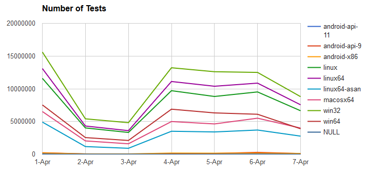

`edges` Clause
===============


Introduction
------------

JSON Query Expressions have an optional `edges` clause for grouping and
Cartesian (product) joins over multiple domains. 

### Specific Domain example ###

For the first example, we have a fully explicit query, which is best for
understanding the general structure of an `edge`.

We want to collect summary statistics for each for each of the testing
platforms. In this case, the platform name is in the `build.platform`
property, and we expect those names to belong to the set of five known
platforms  


	{
		"from": "unittest",
		"select": {"aggregate":"count"},
		"edges":[
			{
				"name":"platform", 
				"value":"build.platform", 
				"domain":{
					"type":"set",
					"key": "name",
					"partitions":[
						{"name":"linux"},
						{"name":"linux64"},
						{"name":"macosx64"},
						{"name":"win32"}
						{"name":"win64"}
					]
				}
			} 
		],
		"limit": 10000
	}

You can see the `domain` is defined as `set`, it lists the five members of
that set, gives each a name, and says the `name` as the canonical `key` when
matching to the platform.

You could have put the domain parts into a SQL table (named "domain") and do
something similar. We will use a right-join to ensure we list every platform,
even if the count is zero: 

	SELECT
		"domain"."name",
		count(1) "count"
	FROM
		"unittest"
	RIGHT JOIN
		"domain" on "domain"."name"=="unittest"."build.platform"


Here is the result of the JSON query:

	{
	    "select":{"aggregate":"count","name":"count","value":"."},
		"edges":[{
    	    "allowNulls":true,
        	"domain":{
        	    "isFacet":false,
        	    "type":"set",
            	"name":"set",
	            "key":"name",
            	"partitions":[
                	{"name":"linux"},
                	{"name":"linux64"},
                	{"name":"macosx64"},
                	{"name":"win32"},
                	{"name":"win64"}
            	]
        	},
        	"name":"platform",
        	"value":"build.platform"
    	}],
    	"data":{
			"count":[52541557,59667209,28690840,71153925,34614053,21860140]
		}
    }

The result will repeat (and elaborate) on the query, and provide the count for
each of the given platforms.

But there are 6 values and only 5 parts! The definition of the `edge` includes
`"allowNulls":true,` (which is default), and indicates that ***all*** records
will be accounted for, whether they fit in the domain or not. Any records that
are not in the domain will be aggregated to the `null` part; which is always
the last value in the array. You use this `null` part to ensure you have not
mistakenly missed some platforms, or have test results that are missing
platforms. We will identify those shortly.

The SQL query example does not give the same result. It would be complicated
by a full outer join to capture these overlooked platforms, and further
select-clause shenanigans to summarize the count simply.   Furthermore an
`edge` will ensure every record is account for only once; there is no double
counting; hence they are called `partitions`, with match priority given to the
first-most.

The `domain` sub-clause is a verbose structure, not suitable for human use,
but very useful when automatically composing queries. Usually, domains are
pre-defined based on the business logic, and simplify queries greatly.

Our example query did not cover all platforms; there appears to be
21,860,140 tests that have been run on some other platform. What are they?

### The `default` Domain ###

We can use the `default` domain type to help discover these other platforms: 

	{
		"from": "unittest",
		"select": {"aggregate":"count"},
		"edges":[
			{
				"name":"platform", 
				"value":"build.platform", 
				"domain":{
					"type":"default"
				}
			} 
		],
		"limit": 10000
	}

The `default` domain is just like the `set` domain, but will identify the
partitions for us. Here is the result:

	{
		"edges":[{
	        "allowNulls":true,
	        "domain":{
	            "isFacet":false,
	            "type":"set",
	            "key":"value",
	            "partitions":[
	                {"name":"android-api-11", "value":"android-api-11", "dataIndex":0},
	                {"name":"android-api-9", "value":"android-api-9", "dataIndex":1},
	                {"name":"android-x86","value":"android-x86","dataIndex":2},
	                {"name":"linux","value":"linux","dataIndex":3},
	                {"name":"linux64","value":"linux64","dataIndex":4},
	                {"name":"linux64-asan", "value":"linux64-asan", "dataIndex":5},
	                {"name":"macosx64","value":"macosx64","dataIndex":6},
	                {"name":"win32","value":"win32","dataIndex":7},
	                {"name":"win64","value":"win64","dataIndex":8}
	            ]
	        },
	        "name":"platform",
	        "value":"build.platform"
	    }],
	    "data":{"count":[
	        82352,
	        875561,
	        899296,
	        53019451,
	        60278371,
	        20157847,
	        28939887,
	        71874258,
	        34910481,
	        0
	    ]},
	    "select":{"aggregate":"count","name":"count","value":"."}
	}

All the distinct `build.platform` values are listed, given a name, ordered,
and assigned a `dataIndex`. Domains are meant to be predefined, and the
partitions are ordered by priority (in the event their definitions overlap).
The `dataIndex` allows use to specify the *natural* presentation order for
a UI, or charting.

Again, we have one more value, called he `null` value, and this time we see it
is zero, so we can be confident we have summarized all records. Sometimes,
even using the `default` domain, this is not zero, that would mean there are
records where `build.platform` is missing, or `null`.

The `default` domain is the default choice for edges, so we are not required
to state it in the query. If we are agnostic about the name of our edge, we
can leave that out too.   Also, since we are counting, as per the
[select clause documentation](jx_clause_select.md) we can leave it out too.

	{
		"from": "unittest",
		"edges":[{
				"value":"build.platform", 
		}],
		"limit": 10000
	}

One final simplification: An edge can be simply the property name you want to
summarize:

	{
	    "from": "unittest",
	    "edges": ["build.platform"],
		"limit": 10000

	}

You will find yourself using this form of query often while exploring the
cardinality and quantity of the various properties in ActiveData.  

### The `time` Domain ###

### Time, Duration and Relative Values

ActiveData does not store time data, instead it standardizes all time queries
to unix timestamps (seconds since epoch, GMT). All datetime values going in,
or out, of ActiveData should be converted to GMT (not UTC with its leap
seconds).    

The `"type":"time"` domain will accept relative time values, and allow you to
perform simple time math.   We will list the number of tests each day for the
past week

	{
		"from":"unittest",
		"edges":[{
			"value":"build.date",
			"domain":{"type":"time", "min":"today-week", "max":"today",	"interval":"day"}
		}],
		"where":{"gt":{"build.date":1459468800}},
		"limit": 10000
	}


The `time` domain only needs the `min`, `max` and `interval` to determine how
to partition the records. The query response is more explicit;

	{
		"edges":[{
			"allowNulls":true,
			"domain":{
				"name":"time",
				"min":1459468800,
				"max":1460073600,
				"isFacet":false,
				"interval":86400,
				"key":"min",
				"type":"time",
				"partitions":[
					{"max":1459555200,"dataIndex":0,"min":1459468800},
					{"max":1459641600,"dataIndex":1,"min":1459555200},
					{"max":1459728000,"dataIndex":2,"min":1459641600},
					{"max":1459814400,"dataIndex":3,"min":1459728000},
					{"max":1459900800,"dataIndex":4,"min":1459814400},
					{"max":1459987200,"dataIndex":5,"min":1459900800},
					{"max":1460073600,"dataIndex":6,"min":1459987200}
				]
			},
			"name":"build.date",
			"value":"build.date"
		}],
		"data":{"count":[
			59744583,
			19521771,
			16415821,
			49614700,
			46332543,
			48447935,
			33073211,
			152056
		]},
		"select":{"aggregate":"count","name":"count","value":"."}
	}

You can see each of the days are explicitly detailed, and our `null` part is
showing 152,056 tests outside the time domain: What did we miss? ... Oh yes!
The `"max":"today"` is the beginning of today, and the `null` is capturing
everything since.   I fixed my `where` clause to ensure this does not happen:

	{
		"from":"unittest",
		"edges":[
			"build.platform",
			{
			"value":"build.date",
			"domain":{"type":"time", "min":"today-week", "max":"today",	"interval":"day"}
			}
		],
		"where":{"and":[
			{"gte":{"build.date":1459468800}},
			{"lt":{"build.date":1460073600}}
		]},
		"limit": 10000
	}
	
You can find a little more on time, and time math, in the
[time documentation](jx_time.md).


### Pivot Tables (2 `edges`) ###

We can provide summary statistics over multiple dimensions, usually two, and
deliver them in a compact form back to the client for easy presentation, or
charting.

	{
		"from":"unittest",
		"edges":[
			"build.platform",
			{
				"value":"build.date",
				"domain":{"type":"time", "min":"today-week", "max":"today",	"interval":"day"}
			}
		],
		"where":{"and":[
			{"gte":{"build.date":1459468800}},
			{"lt":{"build.date":1460073600}}
		]},
		"limit": 10000
	}

And we receive:

	"data":{"count":[
		[   39085,       0,       0,        0,        0,    19400,   26703, 0],
		[  228571,   43978,   22997,    86423,   117174,   283084,  100190, 0],
		[  195844,   43106,   43098,   174661,   154287,   177041,  115806, 0],
		[11595969, 4017509, 3326606,  9709414,  8824656,  9519688, 6641254, 0],
		[13094297, 4310450, 3600576, 11112085, 10386908, 10862597, 7551647, 0],
		[ 4914420, 1168284,  905834,  3509486,  3404974,  3696401, 2764430, 0],
		[ 6523406, 2033744, 1596258,  4994325,  4629842,  5505353, 3997391, 0],
		[15614826, 5409011, 4819924, 13212261, 12607134, 12502214, 8797009, 0],
		[ 7538180, 2542764, 2100752,  6881893,  6313046,  6106708, 3887478, 0],
		[       0,       0,       0,        0,        0,        0,       0, 0]
    ]}

I left out the `select` and `edges` properties, and added some white space for
clarity.  You will notice that there is an extra value in each row, and column:
These are he `null` parts; the last row is is counting the number of tests
with platforms outside the domain, by day. The last column in each row is
counting the number of tests where `build.date` is outside the domain (or
missing).

It looks nicer charted



### Tuple Edges ###

Counting the number of tests by platform over time is a good example of dense
cube: Most coordinates have records that occupy it. Some property
combinations do not have that property. For example `run.suite` and
`result.test` describe the name of the suite and the test in that suite
respectively; it a rare two suites have tests by the same name (and even if
they did, they wouldn't be logically the same). It sometimes makes sense to
talk about unique pairs. An `edge` can accept any JSON Expression as a value,
including tuples:

<insert example>


### `range` Edges ###

The an `edge` can be given a `range`, instead of a `value`: This will allow
one record to span multiple parts, or none, and be included in the count.
This breaks the counted-only-once feature of edges, but it is necessary when
records have a lifespan, which is the case with the Bugzilla bug snapshots: 

There are two types of ranges: The `snapshot` counts any range that includes
the start of any domain part; it is good for providing rough time series
statistics quickly; it does not include the transient records. The `inclusive`
range will include any range that intersects with domain part; it provides a
basis for calculating a (?more accurate?) pro-rated aggregate. 


**<insert logical example&gt;**

**<show each variation in a real query&gt;**

**THIS DOC IS INCOMPLETE**

### Domain Ranges ###

A domain has a partition. Usually this partition is defined with a regular
interval, but this may not be what you want in all cases.   You are free to
define the parts of the partition explicitly. For example, we may want a
semi-logarithmic scale to display the spectrum of file sizes. 

```javascript
{
	"from":"unittest",
	"edges":[{
		"name":"size",
		"value":"run.stats.bytes",
		"domain":{
			"type":"range",
			"key":"min",
			"partitions":[
				{"min":0,"max":1000},
				{"min":1000,"max":10000},
				{"min":10000,"max":100000},
				{"min":100000,"max":1000000},
				{"min":1000000,"max":10000000},
				{"min":10000000,"max":100000000},
				{"min":100000000,"max":1000000000},
				{"min":1000000000,"max":10000000000}
			]
		}
	}],
	"where":{"and":[{"eq":{"etl.id":0}}]}
}
```


 

